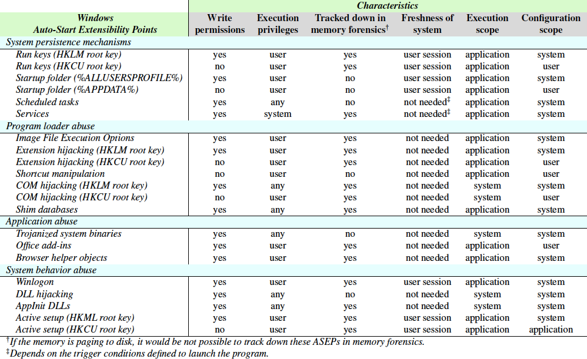

## Winesap - Volatility Plugin

`Winesap` for Volatility 2.6 aims to search for all Autostart Extensibility Points (AESPs), the subset of OS and application extensibility points that allow a program to auto-start without any explicit user invocation.

Specifically, it tries to search AESPs according to this taxonomy:



**NOTE**: you can read more about this taxonomy in this [paper](https://drive.google.com/file/d/1GiGc4Eei4oCvk-5uglWMjblX6yUpI3Lg/view?usp=sharing).

[](https://www.gnu.org/licenses/agpl-3.0)

## Usage

```
---------------------------------
Module Winesap
---------------------------------

Search for all Autostart Extensibility Points (AESPs)

    Options:
        --match: only shows suspicious entries
```

You need to provide this project path as [first parameter to Volatility](https://github.com/volatilityfoundation/volatility/wiki/Volatility-Usage#specifying-additional-plugin-directories):

```
$ python vol.py --plugins /path/to/winesap --profile WinProfile -f /path/to/memory.dump winesap --match
Volatility Foundation Volatility Framework 2.6

------------------------------
WARNING: Suspicious path file, Suspicious shell execution
HKCU\Software\Microsoft\Windows\CurrentVersion\RunOnceEx\0001
RunMyApp: REG_SZ: rundll32.exe shell32.dll,ShellExec_RunDLL C:\Users\User\AppData\Roaming\Btyzjscppg\cmd.exe
------------------------------
WARNING: Suspicious path file, Suspicious shell execution
HKLM\System\ControlSet001\services\Wevbqmpyfl
ImagePath: REG_EXPAND_SZ: rundll32.exe shell32.dll,ShellExec_RunDLL C:\Users\User\AppData\Roaming\Pojgcucima\cmd.exe
------------------------------
WARNING: Suspicious path file
HKLM\Software\Microsoft\Windows NT\CurrentVersion\Image File Execution Options\chrome.exe
Debugger: REG_SZ: C:\Users\User\AppData\Roaming\Aorafljuaz\cmd.exe
------------------------------
```

## License

Licensed under the [GNU AGPLv3](LICENSE) license.
