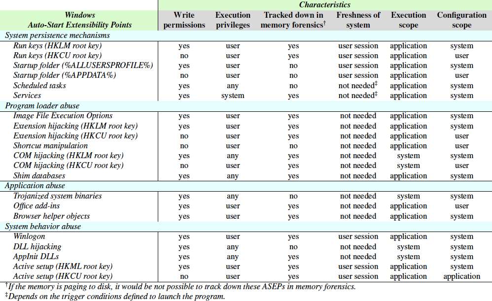

# Winesap — A Volatility Plugin for Windows ASEPs

`Winesap` searches a Windows memory dump for **Auto-Start Extensibility Points (ASEPs)**: the subset of OS and application extensibility points that allow a program to auto-start without any explicit user invocation. It inspects the registry-based ASEPs that malware commonly abuses to achieve persistence and flags the entries that look suspicious.

[](https://www.gnu.org/licenses/agpl-3.0)

> **Volatility 3** is the default on the `master` branch. The original **Volatility 2.6** plugin is preserved on the [`volatility2-latest`](../../tree/volatility2-latest) branch.

## Background

This plugin was developed as part of the academic paper:

> Daniel Uroz and Ricardo J. Rodríguez. **"Characteristics and detectability of Windows auto-start extensibility points in memory forensics."** *Digital Investigation*, vol. 28, supplement, pp. S95–S104, 2019. Proceedings of the Sixth Annual DFRWS Europe (DFRWS EU 2019). DOI: [10.1016/j.diin.2019.01.026](https://doi.org/10.1016/j.diin.2019.01.026).

The paper proposes a taxonomy of Windows ASEPs based on the features that malware uses (or abuses) to persist, grouped into four categories — *system persistence mechanisms*, *program loader abuse*, *application abuse*, and *system behavior abuse* — and characterizes each extensibility point by its write permissions, execution privileges, detectability in memory forensics, and execution/configuration scope. `Winesap` implements the detection of the registry-based ASEPs from that taxonomy.

📄 Author's copy of the paper: [webdiis.unizar.es/~ricardo/files/papers/UR-DIIN-19.pdf](http://webdiis.unizar.es/~ricardo/files/papers/UR-DIIN-19.pdf)



## Coverage

`Winesap` inspects the following registry-based ASEPs:

- **Run / RunOnce / RunOnceEx** keys, under `HKCU` and `HKLM`, including the *Terminal Server\Install* variants.
- **Active Setup** *Installed Components* (`StubPath`).
- **Services** (`ImagePath`) under the current control set.
- **Image File Execution Options** (`Debugger`).
- **Winlogon** (`Shell`, `Userinit`).
- **AppInit_DLLs** (native and `Wow6432Node`).

Every `NTUSER.DAT` hive is scanned, so per-user (`HKCU`) autostart entries are reported for **all** user profiles present in the dump, not just one.

An entry is flagged with a warning when its value data matches a known-suspicious pattern, e.g. an executable run from `AppData`/`Roaming`/`Temp`, an Alternate Data Stream (ADS) loaded via `regsvr32`/`rundll32`, shell execution through `shell32.dll`, or an embedded PE file.

## Usage

Add this project's path to Volatility 3 with the `-p` (plugin directory) option. The plugin is then available as `winesap.Winesap`:

```
$ python3 vol.py -p /path/to/winesap -f /path/to/memory.dump winesap.Winesap [--match]
```

| Option | Description |
| --- | --- |
| `--match` | Only show suspicious entries (those with a warning). |

Example (a Windows 7 dump infected with the Alina PoS malware):

```
$ python3 vol.py -p /path/to/winesap -f infected.elf winesap.Winesap --match
Volatility 3 Framework 2.28.1

RegType  RegName     RegKey                                                        RegValue                                            Warning
REG_SZ   ALINAhuahs  HKCU [Usuario]\Software\Microsoft\Windows\CurrentVersion\Run  C:\Users\Usuario\AppData\Roaming\ALINA_CJLXYJ.exe   Suspicious path file
```

The output is a `TreeGrid`, so it also works with the standard Volatility 3 renderers (`-r csv`, `-r json`, `-r pretty`). Per-user `HKCU` rows are labelled with the originating profile (e.g. `HKCU [Usuario]`).

## How to cite

If you use `Winesap` in your research, please cite the paper:

```bibtex
@article{Uroz2019Winesap,
  title     = {Characteristics and detectability of {Windows} auto-start extensibility points in memory forensics},
  author    = {Uroz, Daniel and Rodr{\'i}guez, Ricardo J.},
  journal   = {Digital Investigation},
  volume    = {28},
  pages     = {S95--S104},
  year      = {2019},
  issn      = {1742-2876},
  doi       = {10.1016/j.diin.2019.01.026},
  publisher = {Elsevier},
  note      = {Proceedings of the Sixth Annual DFRWS Europe (DFRWS EU 2019)}
}
```

## License

Licensed under the [GNU AGPLv3](LICENSE) license.
